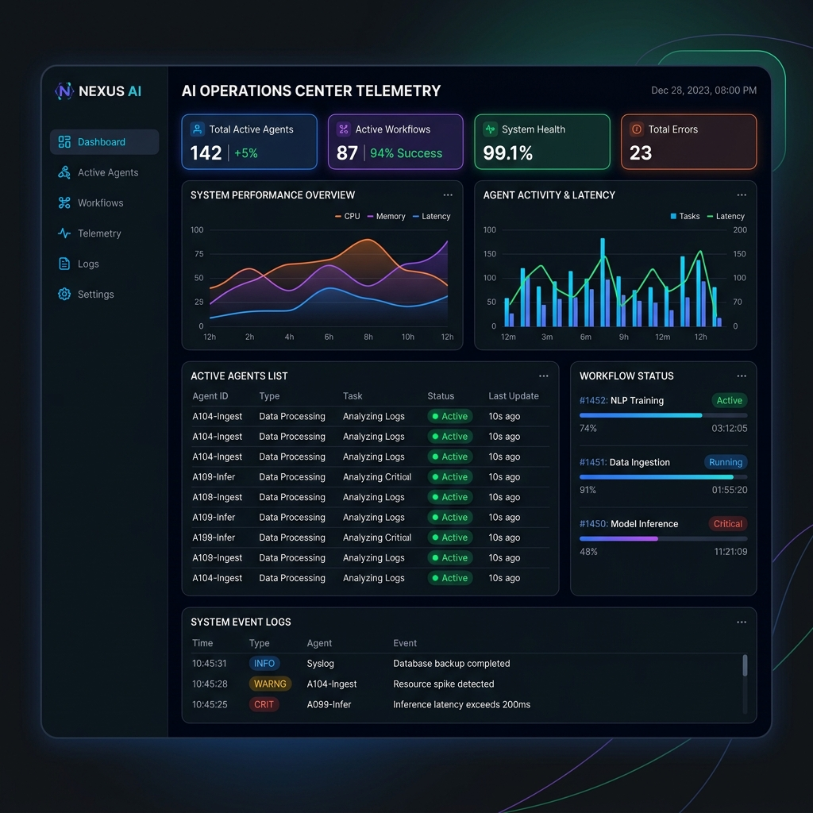

# 🤖 IntelFlow — Enterprise Multi-Agent RAG Platform

IntelFlow is a production-grade, highly-available Multi-Agent RAG Platform orchestrated by **LangGraph**, backed by a **FastAPI** backend, **Next.js 15** frontend, **Qdrant** vector search engine, **Neo4j** knowledge graphs, and **MinIO** object storage.

[](https://github.com/harshchavan009/AI-Chatbot/actions/workflows/ci.yml)
[](https://github.com/harshchavan009/AI-Chatbot/actions/workflows/cd.yml)
[](https://opensource.org/licenses/MIT)

---

## 🖥️ Live Telemetry Dashboard
The dashboard displays real-time operations metrics, query streams, running agents, indexing queues, and active workflow graphs streamed dynamically over **WebSockets**.



---

## 🏗️ Architecture & Data Flow

```
                     ┌────────────────────────────────────────┐
                     │          Nginx Reverse Proxy           │
                     │       Port 80/443 (HTTP/HTTPS)         │
                     └───────────┬────────────────┬───────────┘
                                 │                │
                     ┌───────────▼────┐   ┌───────▼───────────┐
                     │   Next.js 15   │   │  FastAPI (Uvicorn)│
                     │  (Frontend App)│   │   (Backend API)   │
                     │   Port 3000    │   │     Port 8000     │
                     └────────────────┘   └───────┬───────────┘
                                                  │
                 ┌────────────────────────────────┴───────────────┐
                 │                                                │
      ┌──────────▼──────────┐                          ┌──────────▼──────────┐
      │     Database        │                          │     AI & Search     │
      ├─────────────────────┤                          ├─────────────────────┤
      │ 🐘 PostgreSQL 16    │                          │ 🟣 Qdrant (Vector)   │
      │ 🔀 Neo4j (Graph DB) │                          │ 🗂️ MinIO (S3 Bucket)│
      └─────────────────────┘                          └─────────────────────┘
                 │                                                │
                 └────────────────────────┬───────────────────────┘
                                          │
                               ┌──────────▼──────────┐
                               │   Queue & Workers   │
                               ├─────────────────────┤
                               │ 🔴 Redis 7 (Cache)  │
                               │ 🌸 Celery Workers   │
                               └─────────────────────┘
```

1. **Client Request**: Requests route through Nginx to either Next.js (port 3000) or FastAPI (port 8000).
2. **WebSockets Stream**: Live telemetry, token consumption, latency, and logs are continuously pushed from FastAPI to Next.js clients over WebSocket channels (`ws://`).
3. **Agentic Reasoning**: Requests trigger a **LangGraph state machine** consisting of a Supervisor Agent routing queries to specialized child nodes (RAG, Web Research, Python Sandbox, Compliance, PDF Report).
4. **Hybrid Retrieval**: Search combines semantic vectors from Qdrant with graph entity relationship paths from Neo4j.
5. **Background Ingestion**: File uploads are stored in MinIO (S3 compatible), chunked, and vectorized via Celery background tasks brokeraged by Redis.

---

## ✨ Core Features

* **Multi-Agent LangGraph Orchestration**: Supervisor-guided routing across custom agents (Research, RAG, Code Execution, Compliance, and PDF Generation).
* **Live WebSocket Telemetry**: Operations Center displaying rolling charts of average latency, cumulative token usage, running worker node progress, Celery queue depth, file indexing pipelines, and live audit event logs.
* **Hybrid Retrieval (RAG + Knowledge Graph)**: Qdrant vector retrieval combined with Neo4j graph entity lookups for deep contextual search.
* **S3-Compatible Object Storage**: Ingestion pipeline powered by MinIO for secure document storage.
* **Robust Background Workers**: Redis and Celery handle high-throughput file parsing, chunking, and embedding creation asynchronously.
* **Security & Guardrails**: JWT refresh-token authentication, Role-Based Access Control (RBAC), and automated PII redaction guardrails.
* **Playwright E2E Tests**: Comprehensive end-to-end user flow testing covering dashboard interactivity, active states, and toggling.
* **Production-Grade CI/CD**: Automatic linting (Ruff), testing (Pytest), building (Docker Buildx to GHCR), and deployment (Railway staging / AWS ECS Fargate production) on merges.

---

## 🛠️ Installation & Setup

### Prerequisites
- Node.js 20+
- Python 3.11+
- Docker & Docker Compose
- OpenAI API Key

### Option A: Quickstart with Docker Compose (Recommended)
You can launch the entire stack—including PostgreSQL, Redis, Qdrant, Neo4j, MinIO, Nginx, Next.js, and FastAPI—with one command:

```bash
# Clone the repository
git clone https://github.com/harshchavan009/AI-Chatbot.git
cd AI-Chatbot

# Configure credentials
cp backend/.env.example backend/.env
# Edit backend/.env and add your OPENAI_API_KEY

# Start everything
docker compose up --build
```
- **Frontend App**: http://localhost:3000
- **FastAPI API**: http://localhost:8000
- **Swagger Docs**: http://localhost:8000/docs
- **MinIO Console**: http://localhost:9001
- **Flower (Celery)**: http://localhost:5555

---

### Option B: Local Manual Development
If you prefer to run services outside of Docker:

#### 1. Backend Server Setup
```bash
cd backend
python3 -m venv venv
source venv/bin/activate
pip install -r requirements.txt

# Run migrations and start server
uvicorn app.main:app --port 8000 --reload
```

#### 2. Frontend Next.js Setup
```bash
cd frontend
npm install
npm run dev
```

---

## 🧪 Testing Suite
We maintain unit tests, integration tests, API tests, and browser E2E tests.

```bash
# Run all tests (via Makefile)
make test

# Run backend Pytests
make test-backend

# Run frontend Playwright E2E tests
make test-e2e
```

---

## 🔌 API & Postman Integration
The API endpoints are fully self-documenting:
- **Interactive Swagger Docs**: Available at http://localhost:8000/docs while the backend is running.
- **OpenAPI Schema**: Exported to [openapi.json](./openapi.json) in the project root.
- **Postman Collection**: Import [postman_collection.json](./postman_collection.json) directly into Postman to test requests (includes authorization headers and environments).

---

## 📁 Project Structure

```
├── backend/                   # FastAPI backend application
│   ├── app/
│   │   ├── agents/            # LangGraph multi-agent orchestration
│   │   ├── api/               # Router endpoints (auth, chats, workflows)
│   │   ├── core/              # Security, telemetry, databases, configs
│   │   ├── models/            # SQLAlchemy database models
│   │   ├── rag/               # Vector & memory retrieval pipelines
│   │   └── services/          # Storage, evaluation, PDF generation services
│   ├── tests/                 # Pytest test files
│   ├── Dockerfile
│   └── requirements.txt
│
├── frontend/                  # Next.js frontend application
│   ├── src/app/               # Pages (Dashboard, Workflows, Observatory)
│   ├── e2e/                   # Playwright E2E tests
│   ├── Dockerfile
│   └── package.json
│
├── infra/                     # Infrastructure configurations
│   ├── aws/                   # CloudFormation & task definitions
│   ├── nginx/                 # Nginx proxy routing files
│   └── qdrant/                # Vector store configuration files
│
├── .github/workflows/         # CI/CD Workflows
│   ├── ci.yml                 # PR check (Lint, Test, E2E tests, Trivy)
│   └── cd.yml                 # CD Deploy (Verify -> Build -> Push -> Deploy)
│
├── openapi.json               # Exported Swagger/OpenAPI Spec
├── postman_collection.json    # Exported Postman Collection
├── docker-compose.yml         # Dev Environment Stack
└── Makefile                   # Command shortcuts (make dev, make test)
```

---

## 🔮 Future Roadmap
- [ ] **LlamaIndex Integration**: Add LlamaIndex as an optional alternative RAG engine.
- [ ] **GraphRAG Enhancements**: Implement advanced entity extraction and communities parsing in Neo4j.
- [ ] **Custom Agent Nodes**: Enable users to dynamically construct and save agent nodes in a Canvas workflow designer.
- [ ] **Multimodal Search**: Extend Qdrant pipeline to index images, charts, and diagrams.

---

## 🚀 Production Deployment (Railway)

We package the entire application (Next.js static export + FastAPI backend) into a single, unified Docker container. This allows you to host the entire system under a **single Railway URL** with zero CORS conflicts, secure WebSocket handshakes, and minimal operational overhead.

### 📦 Unified Docker Build
The root [Dockerfile](file:///Users/harsh/Desktop/Multi%20agent%20rag/Dockerfile) utilizes a multi-stage process:
1. **Builds the Next.js Frontend**: Triggers static HTML exports to `frontend/dist` with unoptimized image assets.
2. **Prepares the Python Backend**: Installs system requirements like `ffmpeg` (for Whispering speech-to-text workflows) and all FastAPI libraries.
3. **Packages Together**: Copies the static frontend assets directly into the runtime context so FastAPI serves them from root `/` while running API endpoints under `/api/*`.

### 🚏 Railway Setup
The deployment is configured via [railway.toml](file:///Users/harsh/Desktop/Multi%20agent%20rag/railway.toml). To deploy the platform:

1. **Create a new Railway Project** and choose **Deploy from GitHub Repository**.
2. **Add dynamic services** (PostgreSQL, Redis) directly to your project workspace.
3. **Configure Environment Secrets** in the unified application service:
   - `DATABASE_URL`: Your PostgreSQL connection string.
   - `REDIS_URL`: Your Redis connection string.
   - `QDRANT_URL`: URL of your Qdrant instance.
   - `QDRANT_API_KEY`: API key for Qdrant.
   - `NEO4J_URI`: Aura DB/Neo4j graph store URI.
   - `NEO4J_USERNAME`: Neo4j graph username.
   - `NEO4J_PASSWORD`: Neo4j graph credentials.
   - `OPENAI_API_KEY`: Your OpenAI Secret Key.
   - `JWT_SECRET_KEY`: Random 256-bit hash key for credentials signing.
   - `ENV`: `production`
4. **Trigger Deploy**: Railway automatically detects the root `Dockerfile` and deploys it on every push to the default branch.

